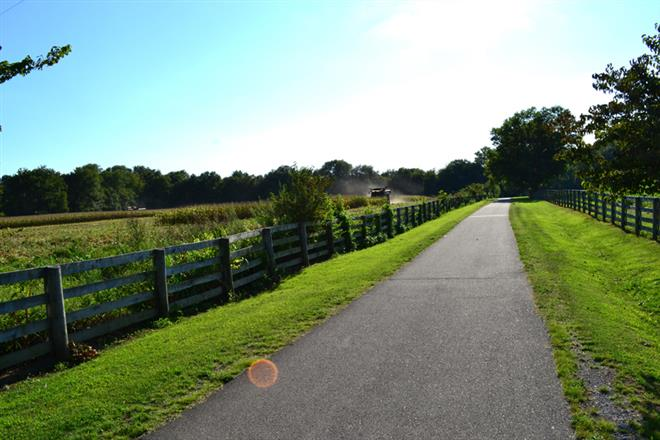

```{r setup, include=FALSE}
options(htmltools.dir.version = FALSE)
# rmarkdown::render("msu-workshop-2019.rmd", output_file = 'index.html')
library(knitr)
library(tidyverse)
library(equatiomatic)
```

# #whoami

.pull-left[
* Joshua Rosenberg, Ph.D.
* Assistant Professor, STEM Education, University of Tennessee, Knoxville
* Dad (16 month toddler!)
* Primary areas of interest
  * Data science in education
  * Data science education
]

```{r, out.width = "350px", echo = FALSE, fig.align = "center"}

```

---
class: inverse, center, middle
# Background/Motivation

---

# Rationale and Aim

- Mixed effects (or multilevel) models are extensions of linear models (regressions)
- Commonly used in experimental and observational research and policy and evaluation contexts
- Are less widely-used by data scientists
  - One piece of evidence: Cross Validated has 1,392 questions tagged #mixed-model that are unanswere (of 3,337 total questions)
- I am trying to introduce mixed effects model as a data science(-*ish*) statistical method that can be useful and is easy to estimate and interpret.

---

# Example: Rail-trails!

## Springfield Greenway



*Image from kz440gal on TraiLink.com*

---

# The Rails-to-Trails Conservancy

- Rail trails are railroad tracks that have been converted into pathways/greenways
- The [Rails-to-Trails Conservancy](https://www.railstotrails.org/) is an organization "dedicated to creating a nationwide network of trails from former rail lines and connecting corridors to build healthier places for healthier people"
- [TrailLink](https://www.traillink.com/) is their website that lists most of the rail-trails in the United States (~4,000 total)
- Let's take a look at their website

---

# TrailLink.com

- What rail-trail is best?
  - In one state
  - Across the nation
- This can be a (surprisingly) difficult question to answer
- View trails in TN here: https://www.traillink.com/trailsearch/?mmloc=tn

**<center>What do you think? Which is (or, which are) the best?</center>**

<center>Discuss your answer with an elbow partner!</center>

---
class: inverse, center, middle
# Building up to Mixed Effects Models
---

# One data-based solution: Use a regression model!

```{r, eval = FALSE, echo = FALSE}
library(equatiomatic)
mod1 <- lm(mpg ~ cyl + disp, mtcars)
extract_eq(mod1)
```

$$
\text{y^} = \alpha + \beta_{1}(\text{var1}) + \beta_{2}(\text{var2}) + \epsilon
$$
---

# Accessing rail-trails data

- Use the `railtrails` R package
  - Install via `install.packages('railtrails')`)
  
```{r}
library(railtrails)
```

```{r}
railtrails
```

---

# Let's focus in on Tennessee

```{r}
library(dplyr)

d <- railtrails %>% 
  filter(state == "TN")

d
```

---

# Let's 'unnest' the reviews

```{r}
d <- d %>% 
  unnest(raw_reviews) %>% 
  rename(raw_review = raw_reviews)

d
```

---

```{r}
m1 <- lm(raw_review ~ -1 + name, data = d)
```

---
# Finding the means of the reviews

```{r}
mean_reviews <- d %>% 
  group_by(name) %>% 
  summarize(mean_review = mean(raw_review, na.rm = TRUE),
            sd_review = sd(raw_review, na.rm = TRUE),
            n_reviews = n()) %>% 
  arrange(desc(mean_review))

mean_reviews
```
---

# Plotting the results

```{r, fig.align='center', fig.width=5, fig.height=5, warning = FALSE}
library(ggplot2)
mean_reviews %>% 
  filter(!is.na(mean_review)) %>% 
  ggplot(aes(x = reorder(name, mean_review), y = mean_review)) +
  geom_point(color = "red") +
  geom_errorbar(aes(ymin = mean_review - sd_review * 1.96 / sqrt(n_reviews - 1),
                ymax = mean_review + sd_review * 1.96 / sqrt(n_reviews - 1))) +
  coord_flip()
```

---

# What does the model look like?


---
class: inverse, center, middle
# Examples
---
I focus on two examples using the lme4 package in R: one each that is focused on:
traditional research (modeling hierarchically nested data
student engagement in science
commercial (estimating the best product when products have different numbers of reviews) uses
What is the best pair of boots? R.E.I.

---
class: inverse, center, middle
# Connection to Bayesian Methods
---

Finally, I discuss the close connection between mixed effects models and Bayesian methods.
brms

---
class: inverse, center, middle
# Conclusion
---
sd

---

class: inverse, center, middle
# Wrapping up
---

# Contact
- [Joshua Rosenberg](mailto:jmrosenberg@utk.edu)